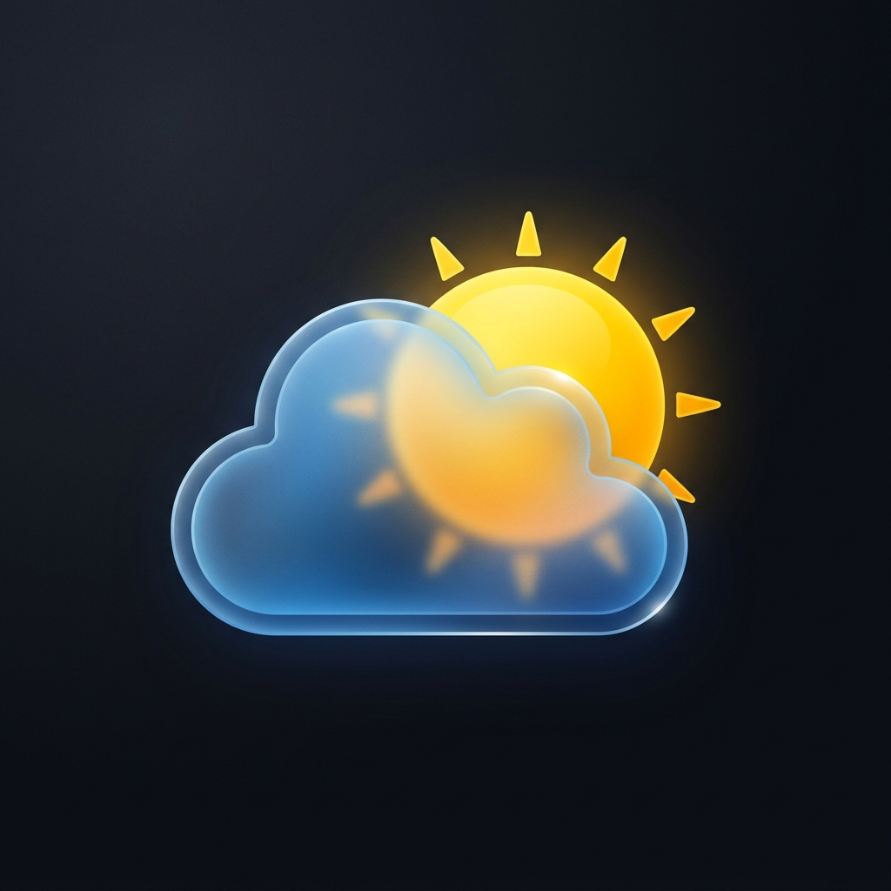

# 🌦️ SkyCast - Premium Weather Experience

SkyCast is a high-fidelity, real-time weather application built with **Nuxt 4** and **Vue 3**. It features a stunning glass-morphic UI, dynamic weather particle effects, and AI-driven weather insights to provide a truly immersive forecasting experience.



## ✨ Features

- **Real-time Forecasts**: Accurate data powered by the Open-Meteo API.
- **Dynamic Aesthetics**: The interface evolves based on weather conditions (Clear, Rain, Snow, Thunderstorm, Fog).
- **Immersive FX**: Custom particle systems for rain, snow, stars, and even independent lightning bolts.
- **AI Weather Insights**: Context-aware advice on what to wear and activity recommendations based on current conditions.
- **Smart Search**: Fast city search with autocomplete suggestions.
- **Geolocation**: Instant local weather with one-click location access.
- **Responsive Design**: Premium look and feel across all device sizes.

## 🚀 Tech Stack

- **Framework**: [Nuxt 4](https://nuxt.com/)
- **Frontend**: [Vue 3](https://vuejs.org/) (Composition API)
- **Data Source**: [Open-Meteo API](https://open-meteo.com/)
- **Styling**: Vanilla CSS with modern Glassmorphism principles.

## 🛠️ Installation & Setup

1. **Clone and install dependencies**:
   ```bash
   npm install
   ```

2. **Run in development mode**:
   ```bash
   npm run dev
   ```

3. **Build for production**:
   ```bash
   npm run build
   ```

## 🗺️ Project Roadmap

Below are the planned enhancements for SkyCast:

### Phase 1: Core Architecture & Maintenance
- [ ] **Component Refactoring**: Split `app.vue` into modular components (WeatherCard, ForecastList, AIPanel).
- [ ] **Unit Toggle**: Support for Fahrenheit, mph, and imperial measurements.
- [ ] **Accessibility (A11y)**: Full keyboard navigation and enhanced ARIA descriptions.

### Phase 2: User Personalization
- [ ] **Saved Locations**: Local storage support to "favorite" and quickly switch between multiple cities.
- [ ] **Theme Customization**: User-selectable accent colors and glass opacity levels.

### Phase 3: Advanced Data & Visuals
- [ ] **Air Quality Index (AQI)**: Detailed breakdown of pollutants and health advice.
- [ ] **Historical Trends**: 24-hour temperature and precipitation charts.
- [ ] **Radar Integration**: Interactive weather maps showing precipitation patterns.

### Phase 4: Social & Sharing
- [ ] **Dynamic OG Images**: Automatically generated social sharing cards showing local weather.
- [ ] **Shareable Links**: Deep links to specific city forecasts.

## 📄 License

This project is open-source and available under the [MIT License](LICENSE).

---
*Created with ❤️ by the SkyCast Team.*
